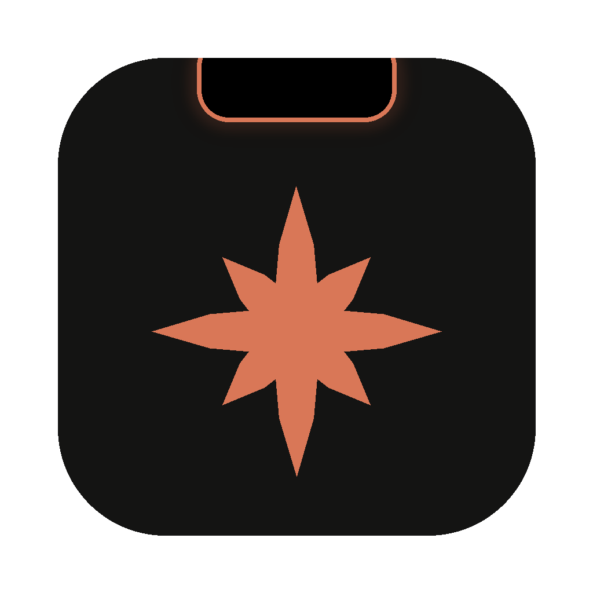

<p align="center"></p>

<h1 align="center">Notchwerk</h1>

<p align="center"><em>für Claude Code</em></p>

<p align="center">Ein orangener Rand um den Notch deines MacBooks, der aufklappt sobald Claude dich braucht.</p>

Notchwerk ist eine kleine, kostenlose Mac App für die Menüleiste. Sie zeigt dir am Notch (oder oben rechts auf einem externen Bildschirm) was Claude Code gerade macht. Wenn Claude eine Freigabe braucht oder eine Frage hat, klappt der Notch mit einer Animation auf und du kannst direkt dort antworten. Das funktioniert auch über Vollbild-Apps und Filmen.

> Inoffizielles Hobbyprojekt. Nicht von Anthropic und nicht mit Anthropic verbunden. „Claude“ und „Claude Code“ sind Marken von Anthropic, PBC und werden hier nur beschreibend genannt, weil die App mit Claude Code zusammenarbeitet. Lizenz: MIT, ohne Gewähr (siehe `LICENSE`).

## Über dieses Projekt

Notchwerk ist ein privates Hobbyprojekt von Jakob Weigand. Es ist kostenlos, verfolgt kein kommerzielles Interesse und wird in der Freizeit gepflegt, ohne Zusage, wie schnell Fehler behoben werden. Fragen, Fehler und Ideen bitte als [Issue auf GitHub](https://github.com/JakobWeigand/notchwerk/issues). Wer die App weiterentwickeln möchte, forkt das Repo einfach (MIT-Lizenz) oder schickt einen Pull Request.

## Was die App kann

| Zustand | Am Notch | Auf Bildschirmen ohne Notch |
|---|---|---|
| Ruhe | dünner orangener Rand um den Notch | das Claude-Maskottchen oben rechts, ohne Kasten und Rand. Es blinzelt, schaut sich um und winkt ab und zu. Klick öffnet die Liste |
| Claude arbeitet | Notch wird breiter, links dreht sich ein Funke, rechts läuft das Maskottchen. Überfahren zeigt die Sitzungen, die gerade arbeiten | Pille mit aktueller Aktion, Klick zeigt die Sitzungen |
| Claude braucht eine Freigabe | Notch klappt auf, pulsiert und zeigt Befehl mit **Erlauben / Immer erlauben / Ablehnen / Im Terminal** | gleiche Karte oben rechts |
| Claude hat eine Frage | Frage und Antwortmöglichkeiten | gleich |
| Claude ist fertig | kurze Einblendung „Fertig“ mit Ton, die Zeile verschwindet kurz danach | gleich |
| Claude App wird gestartet | kurze Begrüßung | gleich |

Weitere Punkte

* Bleibt immer im Vordergrund, auch in Vollbild-Spaces und über Videos.
* Erkennt automatisch ob ein Notch da ist. Bei zugeklapptem MacBook an Monitor, Maus und Tastatur erscheint die Anzeige oben rechts (oder oben mittig, umstellbar im Menü).
* Es wird nur gezeigt, was gerade passiert: Sitzungen, die arbeiten oder dich brauchen. Fertige Sitzungen verschwinden wieder. „Wartet“ steht nur da, wenn Claude wirklich eine Freigabe oder Antwort braucht.
* Jede Zeile zeigt, woher die Sitzung kommt: **Terminal**, **VS Code**, **Claude App** (dort mit dem Chat-Titel). Ein Klick auf die Zeile holt genau dieses Fenster nach vorn: den Tab im Terminal, das Projektfenster in VS Code oder den Chat in der Claude App.
* Die Liste erscheint beim Überfahren des Notch (oben rechts per Klick auf das Maskottchen) und verschwindet, sobald die Maus wieder weg ist. Bis zu zwei Zeilen sind sofort zu sehen, bei mehr lässt sich scrollen. Wer die Zeilen dauerhaft unter dem Notch sehen will, schaltet im Menü **Arbeitende Sitzungen unter dem Notch zeigen** ein.
* Unten in der aufgeklappten Liste steht die Nutzung wie bei `/usage`: Ringe für das Sitzungslimit (5 Stunden) und das Wochenlimit, mit dem Anteil, der noch frei ist, und wann sich das Limit zurücksetzt. Bei mehreren Konten eine Zeile je Konto.
* Der Abstand des orangenen Rands unter dem Notch ist einstellbar (Standard 1 mm), damit der echte Notch nicht hervorschaut.
* **Einstellungen** gibt es als eigenes Fenster: über das Zahnrad oben links in der aufgeklappten Liste oder über das Maskottchen in der Menüleiste. Dort lässt sich alles ein- und ausschalten, auch die ganze Anzeige auf einmal („Notchwerk eingeschaltet“). Pausiert fragt Claude Code wie gewohnt im Terminal.
* **Schwebender Reiter** statt Notch: In den Einstellungen unter „Anzeigeart“ wählbar. Das kleine Maskottchen lässt sich mit der Maus an eine beliebige Stelle ziehen, bleibt im Vordergrund, wandert auf jeden Schreibtisch mit und öffnet die Liste beim Überfahren. Praktisch, wenn der Notch beim Surfen zu leicht ausgelöst wird.
* Abgebrochene Sitzungen (Esc, Stopp, Fenster zu) verschwinden von selbst: Die App merkt, wenn der Claude Code Prozess weg ist oder im Transkript „[Request interrupted by user]“ steht.
* Im Menü hinter dem Maskottchen in der Menüleiste stehen die aktiven Sitzungen zum Anklicken, und **Demo abspielen** zeigt alle Animationen ohne Claude. Solange Claude arbeitet, läuft das Maskottchen dort mit; braucht Claude dich, winkt es (abschaltbar).
* Wenn die App nicht läuft, merkt Claude Code nichts davon und fragt ganz normal im Terminal.

### Mehrere Claude Code Konten

Claude Code trennt Konten über den Konfigurationsordner: Das erste Konto liegt in `~/.claude`, ein zweites zum Beispiel in `~/.claude-arbeit` und läuft mit `CLAUDE_CONFIG_DIR="$HOME/.claude-arbeit" claude`. Jeder Ordner hat seine eigene Anmeldung, eigene Einstellungen und eigene Limits.

In den Einstellungen unter **Konten**:

* **Anlegen und anmelden …** legt den Ordner an, verbindet ihn mit Notchwerk und öffnet ein Terminal, in dem du dich mit dem zweiten Konto anmeldest.
* Schon eingerichtete Ordner (`~/.claude-…`) findet die App von selbst und bietet **Übernehmen** an. Andere Orte gehen über **Vorhandenen Ordner wählen …**.
* **Befehl kopieren** legt einen Kurzbefehl für `~/.zshrc` in die Zwischenablage, z.B. `alias claude-arbeit='CLAUDE_CONFIG_DIR="$HOME/.claude-arbeit" claude'`.
* Startest du Claude Code mit einem Ordner, den die App noch nicht kennt, nimmt sie ihn als weiteres Konto auf.

Sitzungen tragen dann den Kontonamen, und die Nutzung erscheint je Konto, in der Liste, im Menü und in den Widgets.

### Widgets

Ab macOS 14 bringt die App Widgets für den Schreibtisch und die Mitteilungszentrale mit. Einschalten unter Einstellungen › **Widgets**, dann Rechtsklick auf den Schreibtisch › **Widgets bearbeiten …** › nach „Notchwerk“ suchen.

| Widget | Größen | Zeigt |
|---|---|---|
| Sitzungslimit | klein, mittel | 5-Stunden-Limit mit Ring und Zeit bis zum Zurücksetzen |
| Wochenlimit | klein, mittel | Wochenlimit über alle Modelle |
| Fable-5-Limit | klein, mittel | eigenes Wochenlimit für Fable 5 |
| Übersicht | klein, mittel, groß | Sitzungs- und Wochenlimit zusammen |
| Übersicht mit Fable 5 | klein, mittel, groß | Sitzung, Woche und Fable 5 zusammen |
| Alle Konten | mittel, groß | alle Konten nebeneinander |

Ein Klick auf ein Widget klappt die Liste auf. Die Widgets laufen in einer Sandbox ohne Netz und ohne Schlüsselbund. Sie lesen nur die Prozentwerte und Zeitpunkte, die Notchwerk in `~/.claude-notch/widget/usage.json` ablegt. Damit die Zahlen frisch bleiben, fragt die App bei eingeschalteten Widgets im Hintergrund nach (Standard alle 15 Minuten, einstellbar).

## Schnellstart ohne Kompilieren

1. Unter [Releases](https://github.com/JakobWeigand/notchwerk/releases/latest) die neueste `Notchwerk.zip` herunterladen. Wer sichergehen will, lädt auch `Notchwerk.zip.sha256` daneben und prüft im Terminal, dass der Download unversehrt ist:
   ```bash
   cd ~/Downloads && shasum -a 256 -c Notchwerk.zip.sha256
   ```
2. Terminal öffnen und diese eine Zeile einfügen
   ```bash
   cd ~/Downloads && { [ -d "Notchwerk.app" ] || ditto -x -k Notchwerk.zip .; } && rm -rf "/Applications/Notchwerk.app" "/Applications/Notchwerk.app" && mv "Notchwerk.app" /Applications/ && xattr -dr com.apple.quarantine "/Applications/Notchwerk.app" && open "/Applications/Notchwerk.app"
   ```
3. Im Fenster „Mit Claude Code verbinden?“ auf **Verbinden** klicken.

Die App startet ab jetzt automatisch beim Anmelden.

## Was die App auf deinem Mac verändert

Damit du vor dem Installieren weißt, worauf du dich einlässt. Alles davon lässt sich mit `./scripts/uninstall.sh` (oder von Hand) rückstandslos entfernen.

| Was | Wo | Wann | Wieder weg mit |
|---|---|---|---|
| Die App selbst | `/Applications/Notchwerk.app` | beim Installieren | in den Papierkorb ziehen |
| Hook-Skript, Port und Token | `~/.claude-notch/` (nur für dich lesbar) | beim Verbinden bzw. bei jedem App-Start | Ordner löschen |
| Hook-Einträge | `~/.claude/settings.json` und bei weiteren Konten deren `settings.json` (vorher je eine Sicherung `settings.json.claude-notch-backup`) | nur nach deinem Klick auf **Verbinden** bzw. beim Anlegen eines Kontos | Menü → **Verbindung entfernen** oder `uninstall.sh` |
| Ordner für ein weiteres Konto, Startskript | z.B. `~/.claude-arbeit`, `~/.claude-notch/anmelden-arbeit.command` | nur bei **Anlegen und anmelden** | Konto entfernen, Ordner löschen |
| Daten für die Widgets | `~/.claude-notch/widget/usage.json` (nur Prozentwerte und Zeitpunkte, keine Tokens) | nur wenn die Widgets eingeschaltet sind | Widgets ausschalten |
| Anmeldeobjekt | Systemeinstellungen → Anmeldeobjekte | erst nach **Verbinden** | Menü → **Beim Anmelden starten** abwählen |
| Einstellungen | `defaults` unter `io.github.jakobweigand.claude-notch` | beim ersten Ändern | `uninstall.sh` |

Dialoge, die macOS zeigen kann, und was sie bedeuten:

* **„Notchwerk möchte Terminal steuern“**: nur wenn du eine Terminal-Sitzung in der Liste anklickst, damit die App den richtigen Tab nach vorn holt. Ablehnen ist folgenlos, dann wird nur das Terminal aktiviert.
* **„Notchwerk möchte deine vertraulichen Informationen in ‚Claude Code-credentials‘ verwenden“**: nur wenn du die Nutzungsanzeige oder die Widgets in den Einstellungen eingeschaltet hast (beides Standard aus), einmal je Konto. Siehe Sicherheit.
* **Gatekeeper-Warnung** beim ersten Start: weil die App nicht bei Apple notarisiert ist. Die Zeile im Schnellstart hebt die Sperre nur für diese eine App auf. Wer das nicht möchte, baut selbst aus dem Quellcode.

Was die App nie tut: ins Netz gehen (außer der optionalen Nutzungsanzeige und den Widgets), Dateien deiner Projekte lesen oder ändern, Freigaben ohne deinen Klick erteilen, im Hintergrund weiterlaufen, wenn du sie beendest. Läuft sie nicht oder stürzt sie ab, merkt Claude Code nur eine Sekunde Verzögerung pro Ereignis und fragt wie gewohnt im Terminal.

## Installation aus dem Quellcode

Du baust die App selbst aus dem Quellcode. Das kostet nichts und macOS zeigt keine Warnung, weil die App auf deinem Mac entstanden ist.

```bash
# 1. Einmalig die kostenlosen Entwicklerwerkzeuge von Apple installieren
xcode-select --install

# 2. Projekt holen und installieren
git clone https://github.com/JakobWeigand/notchwerk.git
cd claude-notch
./scripts/install.sh
```

Beim ersten Start fragt die App, ob sie sich mit Claude Code verbinden soll. Mit **Verbinden** trägt sie einen Hook in `~/.claude/settings.json` ein (vorher wird `settings.json.claude-notch-backup` angelegt). Laufende Claude Code Sitzungen einmal neu starten, danach meldet sich Claude am Notch.

Damit die App nach jedem Neustart läuft, im Menü **Beim Anmelden starten** anhaken.

Aktualisieren geht mit `git pull && ./scripts/install.sh`. Entfernen mit `./scripts/uninstall.sh`.

## Neue Download-Version

Ein Tag genügt. GitHub Actions baut daraus automatisch eine Universal-App (Apple Silicon und Intel) und hängt sie unter **Releases** an.

```bash
git tag v0.2.1 && git push origin v0.2.1
```

Weil die App nicht von Apple notarisiert ist (das kostet 99 $ im Jahr), muss man sie beim ersten Mal per Rechtsklick → **Öffnen** starten oder einmal `xattr -dr com.apple.quarantine "/Applications/Notchwerk.app"` ausführen. Die Zeile im Schnellstart erledigt das schon. Wer keine fremden Programme starten möchte, baut wie oben selbst aus dem Quellcode.

## Sicherheit

Die App braucht keinen Server und kein Konto. Alles bleibt auf deinem Mac. Ins Internet geht nur die optionale Nutzungsabfrage für Liste und Widgets (siehe unten), und die ist standardmäßig aus.

* Claude Code ruft bei jedem Ereignis `~/.claude-notch/hook.sh` auf. Das Skript schickt die Daten an die App, die **nur auf 127.0.0.1** lauscht. Aus dem Netzwerk ist sie nicht erreichbar.
* Bei jedem App-Start entsteht ein neuer zufälliger Token (256 Bit) in `~/.claude-notch/auth-header` mit Rechten `600`. Nur dein Benutzer kann ihn lesen. Anfragen ohne passenden Token lehnt die App ab. So kann kein anderes Programm oder anderer Benutzer heimlich Freigaben erteilen.
* Der Token steht nie in der Befehlszeile und damit auch nicht in der Prozessliste.
* Läuft die App nicht oder antwortest du nicht innerhalb der Wartezeit (Standard 10 Minuten), gibt der Hook keine Entscheidung zurück. Claude Code fragt dann wie gewohnt im Terminal. Es wird also nie automatisch etwas erlaubt.
* Im öffentlichen Repository liegen keine Geheimnisse. Jeder Nutzer bekommt seinen eigenen Token.
* „Immer erlauben“ übernimmt genau die Regel, die Claude Code selbst vorschlägt.
* Die **Nutzungsanzeige** und die **Widgets** sind standardmäßig aus. Schaltest du sie ein, liest die App den Anmelde-Token von Claude Code aus dem Schlüsselbund („Claude Code-credentials“, bei weiteren Konten mit einer Endung je Ordner) und fragt nur die Limits bei `api.anthropic.com` ab, dieselbe Stelle wie `/usage` in Claude Code. macOS fragt dabei nach; mit **Immer erlauben** nie wieder. Nur für die Anzeige abgefragt wird beim Öffnen der Liste; mit Widgets zusätzlich im Hintergrund im eingestellten Abstand (frühestens alle 10 Minuten, bei einer Sperre durch den Server automatisch seltener). Der Token bleibt nur im Arbeitsspeicher. Auf die Platte kommen nur die Prozentwerte für die Widgets. Beachte: Anthropic sieht den Login-Token laut seinen Nutzungsbedingungen nur für Claude Code und claude.ai vor. Diese reine Lese-Abfrage ist formal eine Grauzone, du nutzt sie auf eigene Verantwortung.

## Datenschutz

Die App sammelt keine Daten, enthält keine Analyse- oder Tracking-Bausteine und hat keine Verbindung zu einem Server des Entwicklers. Was Claude Code über die Hooks meldet (Projektpfad, aktuelles Werkzeug, Freigabetexte), wird nur im Arbeitsspeicher gehalten und für die Anzeige genutzt, nie gespeichert oder verschickt. Die einzige Netzverbindung ist die optionale Nutzungsanzeige zu `api.anthropic.com` (siehe Sicherheit). Beim Herunterladen über GitHub Releases gelten die Datenschutzbestimmungen von GitHub.

## Lizenz

MIT-Lizenz, siehe `LICENSE`. Die Software wird ohne jede Gewährleistung bereitgestellt. Der Ordner `~/.claude-notch` und die Kennung `io.github.jakobweigand.claude-notch` sind technische Namen aus der ersten Version und bleiben aus Kompatibilitätsgründen bestehen.

## Wie es funktioniert

```
Claude Code ──Hook──▶ ~/.claude-notch/hook.sh ──HTTP 127.0.0.1 + Token──▶ Notchwerk.app
     ▲                                                                       │
     └──────────────── Antwort (Erlauben / Ablehnen / Antwort) ◀─────────────┘
```

Genutzte Hook-Ereignisse sind `SessionStart`, `UserPromptSubmit`, `PreToolUse`, `PostToolUse`, `PermissionRequest`, `Notification`, `Stop`, `StopFailure` und `SessionEnd`. Die Hooks gelten für Claude Code im Terminal, in der IDE und im Code-Tab der Claude Desktop App.

Woher eine Sitzung kommt, liest `hook.sh` aus der Prozesskette (welche App hat Claude Code gestartet) und schickt sie als Kopfzeile mit. Für Chats im Code-Tab der Desktop App findet die App über `~/Library/Application Support/Claude/claude-code-sessions/` den Chat-Titel und den Link, der genau diesen Chat öffnet. Beim ersten Klick auf eine Terminal-Sitzung fragt macOS einmal, ob Notchwerk das Terminal steuern darf (nur dafür, den richtigen Tab auszuwählen).

## Grenzen

* Normale Chats in der Claude Desktop App und auf claude.ai im Browser bieten keine Schnittstelle. Hier erkennt die App nur, dass Claude geöffnet wurde (Begrüßung und Rand). Ob dort gerade eine Antwort entsteht, lässt sich von außen nicht zuverlässig erkennen. Angezeigt wird alles aus Claude Code: Terminal, VS Code und der Code-Tab der Desktop App.
* In VS Code holt der Klick das Fenster nach vorn, in dem der Projektordner offen ist. Läuft Claude Code dort in einem Unterordner, öffnet VS Code diesen Ordner in einem neuen Fenster.
* Fragen über `AskUserQuestion` im Notch zu beantworten ist experimentell und standardmäßig aus. Dann zeigt der Notch die Frage an und du antwortest im Terminal.
* Benötigt macOS 13 Ventura oder neuer, die Widgets macOS 14 Sonoma.
* Wie viel bei einem Konto noch frei ist, kann die App nur zeigen, wenn Claude Code mit diesem Konto schon einmal angemeldet war. Ist die Anmeldung abgelaufen, das Konto einmal in Claude Code benutzen.

## Selbst entwickeln

```bash
swift build            # schneller Test-Build
swift run              # direkt starten
./scripts/build-app.sh # fertige .app in dist/
```

Nur Command Line Tools ohne Xcode? Dann kann `swift build` mit dem neuesten SDK an `@State` scheitern (dem SDK fehlt das SwiftUI-Makro-Plugin, das erst Xcode mitbringt). `build-app.sh` weicht dann automatisch auf das vorherige SDK aus. Von Hand geht das so:

```bash
SDKROOT=/Library/Developer/CommandLineTools/SDKs/MacOSX26.sdk swift build
```

Der Code liegt in `Sources/Notchwerk` (die App), `Sources/NotchwerkWidgets` (die Widgets) und `Sources/NotchwerkShared` (Farben, Logo und die Datei für die Widgets)

* `NotchView.swift` Aussehen und Animationen
* `SettingsWindow.swift` das Einstellungsfenster
* `NotchModel.swift` Zustände und Verarbeitung der Claude Code Ereignisse
* `NotchWindow.swift` Fenster über allem, Bildschirmerkennung, Maus
* `Geometry.swift` Größen und welcher Zustand gerade gezeigt wird
* `SessionOrigin.swift` Terminal, VS Code oder Claude App? (aus der Prozesskette)
* `DesktopSessions.swift` Chat-Titel und Link für Sitzungen aus der Claude Desktop App
* `SessionFocus.swift` holt beim Klick das richtige Fenster nach vorn
* `Usage.swift` Nutzung (Sitzungs- und Wochenlimit) je Konto wie bei `/usage`, versorgt auch die Widgets
* `Accounts.swift` mehrere Claude Code Konten (Konfigurationsordner, Schlüsselbund, Anmeldung)
* `EventServer.swift` lokaler Server mit Token-Prüfung
* `HookInstaller.swift` Hook-Skript und Eintrag in die `settings.json` jedes Kontos
* `Mascot.swift` das animierte Maskottchen (das Logo selbst steht in `NotchwerkShared/Brand.swift`)
